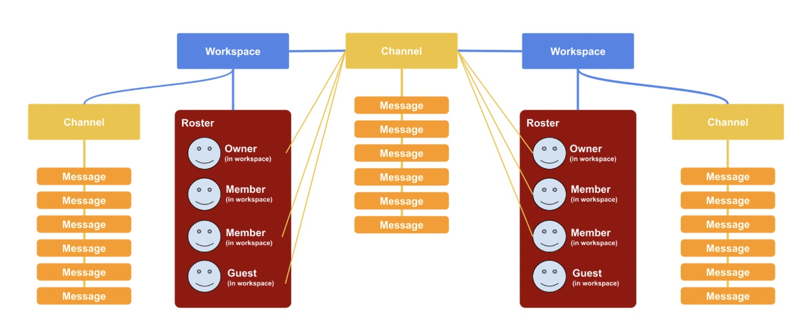

<!-- START doctoc generated TOC please keep comment here to allow auto update -->
<!-- DON'T EDIT THIS SECTION, INSTEAD RE-RUN doctoc TO UPDATE -->
**Table of Contents**  *generated with [DocToc](https://github.com/thlorenz/doctoc)*

- [Challenge Prompt](#challenge-prompt)
  - [Challenge Prompt](#challenge-prompt-1)
- [Prior Art](#prior-art)
- [Data Models](#data-models)
- [Evaluation Criteria](#evaluation-criteria)
  - [Question 1.](#question-1)
  - [Question 2.](#question-2)
  - [Question 3.](#question-3)
  - [Question 4.](#question-4)
  - [Question 5](#question-5)

<!-- END doctoc generated TOC please keep comment here to allow auto update -->

---
- [Home](./index.md) 
- [Challenge](./challenge.md)
- [Response](./solution.md)
- [Source Code](https://github.com/sramam/work-sample)
---

## Challenge Prompt

Slack is a best-in-class SaaS communication tool for companies and organizations of any size to communicate within their team and across other teams. The data hierarchy of an Organization’s Slack Workspace can be considered in the form below.


A Slack Workspace is at the top of the Slack data hierarchy. Every organization that wants to license Slack’s software will need to set up a Workspace for their Organization.

The Workspace’s members will be able to create Channels to communicate in smaller groups. Channels are in the mid-tier of Slack’s data hierarchy. Public Slack Channels can contain all of the members of the Workspace or just a subset of members in the Workspace.

The baseline object of Slack’s data hierarchy is a Message. A Message is the means by which individuals in a Slack organization can communicate information with each other via Channels, DMs, and group messages.

Below is a diagram that visually represents how users that live within a Workspace’s roster may or may not be associated with text Channels in the Workspace.


[Slack Connect](https://api.slack.com/apis/channels-between-orgs#what-is-slack-connect) is one of the latest game-changing features released by Slack that allows for an individual Slack Channel to be the bridge of communication between two Workspaces!

The diagram below shows an example of the sort of communication bridge that Slack Connect is able to create via a Channel.



### Challenge Prompt

Please share a strategy for how you would transition from the traditional multi-tenant architecture, where all data is siloed at each tenant (workspace), to a version of Slack’s architecture that enables multi-tenant interconnectivity between workspaces on Slack.

## Prior Art

At this time, the Slack Team has built out their front-end and backend architecture on the following technical components, part of which, includes having committed to a document-based database in MongoDB.

**Front-end Browser Client:** React (UI framework), Express, Node.js

**Backend-end API Server:** Express, Node.js

You can assume that Slack has committed to a multi-tenant architecture, where each tenant (workspace) has data stored in the same software/hardware vertical and has its data segmented at the application layer.

## Data Models

As a result, the backend data models for how Slack structures its data hierarchy in its MongoDB database have been modeled in the format below.

```typescript
interface Workspace {
  // unique ID for this workspace
  id: string;

  // name of this workspace
  name: string;

  // Date-time for when this channel was created
  createdAt: Date;
}

interface Channel {
  // unique ID for this channel
  id: string;

  // the workspace ID that this channel is contained in
  workspaceId: string;

  // name of this channel, such as #channel-name
  name: string;

  // Date-time for when this channel was created.
  createdAt: Date;
}

interface WorkspaceRole {
  // the workspace this workspace role is tied to
  workspaceId: string;

  // Workspace OWNER or MEMBER of the workspace
  roleType: string;

  // The creation date of this role
  createdAt: Date;

  // The most recent date this role is archived
  archiveDate: Date;
}

interface ChannelRole {
  // the workspace this role is tied to
  workspaceId: string;

  // the channel this role is tied to
  channelId: string;

  // CHANNEL_ADMIN or CHANNEL_MEMBER of the channel
  roleType: string;

  // The creation date of this role
  createdAt: Date;

  // The most recent date this role is archived
  archiveDate: Date;
}

interface User {
  // unique ID for this user
  id: string;

  // name of this user
  name: string;

  // email address of this user
  email: string;

  // the list of roles that this user holds in the workspace
  workspaceRoles: WorkspaceRole[];

  // the list of roles that this user holds in particular channels
  channelRoles: ChannelRole[];

  // Date-time for when this user was created.
  createdAt: Date;
}

interface WorkspaceRole {
  // the workspace this workspace role is tied to
  workspaceId: string;

  // Workspace OWNER or MEMBER of the workspace
  roleType: string;

  // The creation date of this role
  createdAt: Date;

  // The most recent date this role is archived
  archiveDate: Date;
}

interface ChannelRole {
  // the workspace this role is tied to
  workspaceId: string;

  // the channel this role is tied to
  channelId: string;

  // CHANNEL_ADMIN or CHANNEL_MEMBER of the channel
  roleType: string;

  // The creation date of this role
  createdAt: Date;

  // The most recent date this role is archived
  archiveDate: Date;
}

interface User {
  // unique ID for this user
  id: string;

  // name of this user
  name: string;

  // email address of this user
  email: string;

  // the list of roles that this user holds in the workspace
  workspaceRoles: WorkspaceRole[];

  // the list of roles that this user holds in particular channels
  channelRoles: ChannelRole[];

  // Date-time for when this user was created.
  createdAt: Date;
}

interface EmojiReaction {
  // the user ID of the user who sent this emoji reaction
  sentById: string;

  // encoded emoji tag
  emojiTag: string;
}

interface Message {
  // unique ID for this message
  id: string;

  // text found in this message's body
  text: string;

  // the channel ID where this message was sent in
  channelId: string;

  // the user ID of the user who sent this message
  sentById: string;

  // the list of emoji's associated that users reacted to this message with
  emojiReactions: EmojiReaction[];

  // Date-time for when this message was created.
  createdAt: Date;
}
```

## Evaluation Criteria
Some considerations for how your response will be evaluated are:

### Question 1. 
How would you update the application infrastructure to accommodate serving a user base of 1 million yearly users who generate 10 million messages per year? How would your solution scale to serving 10 million users who generate 100 million messages per year?

[Response](./solution.md#1-scale)

### Question 2. 
How would you change the existing data models to accommodate multi-tenant inter-connectivity?

[Response](./solution.md#2-authorization)

### Question 3.
What potential back-end API endpoints (which may have not been specifically outlined in the aforementioned challenge prompt) on the backend API server may need to be adjusted?

[Response](./solution.md#3-api)

### Question 4.
What authorization controls might you consider as adjustments to APIs that might be enabling tenant inter-connectivity, in the paradigm where members of different tenants may have the context to be authorized to use those endpoints?

[Response](./solution.md#4-authz-modifications-on-the-api)

### Question 5
How would you structure the overall migration plan of accomplishing the introduction of such a feature, on the front-end and back-end, with a team of engineers focused on accomplishing this endeavor alongside you?

[Response](./solution.md#5-migration-plan)

---
- [Home](./index.md) 
- [Challenge](./challenge.md)
- [Response](./solution.md)
- [Source Code](https://github.com/sramam/work-sample)
---
