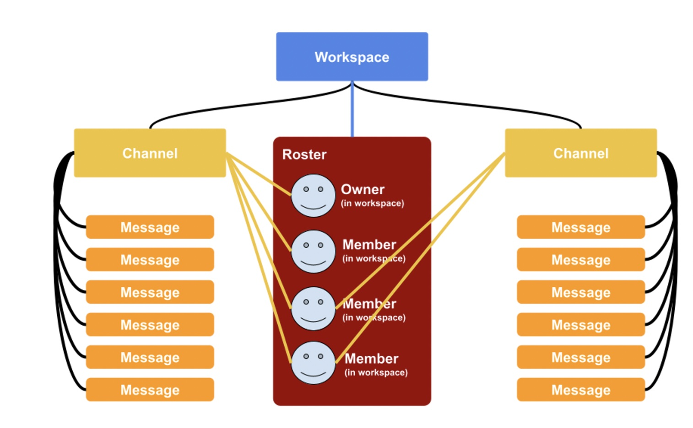
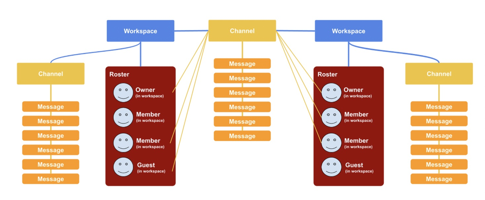
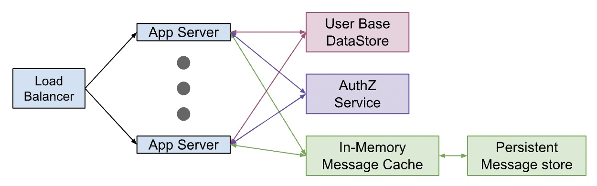

<!-- START doctoc generated TOC please keep comment here to allow auto update -->
<!-- DON'T EDIT THIS SECTION, INSTEAD RE-RUN doctoc TO UPDATE -->
**Table of Contents**  *generated with [DocToc](https://github.com/thlorenz/doctoc)*

- [What/why is this?](#whatwhy-is-this)
- [The Challenge](#the-challenge)
  - [Challenge tl;dr](#challenge-tldr)
- [The Response](#the-response)
  - [1. POC](#1-poc)
  - [2. Response to Challenge](#2-response-to-challenge)
  - [3. Innovation/Creative engineering](#3-innovationcreative-engineering)
  - [4. Project Plan](#4-project-plan)

<!-- END doctoc generated TOC please keep comment here to allow auto update -->

---

- [Home](https://sramam.github.io/work-sample/) 
- [Challenge](https://sramam.github.io/work-sample/challenge.md)
- [Response](https://sramam.github.io/work-sample/solution.md)
- [Source Code](https://github.com/sramam/work-sample)

---

## What/why is this?
> I am actively interviewing for senior engineering roles.
> Each interview process tries to establish a base-line in it's own way - some better than others.
>
> I spent considerable time on one of these assignments. I decided to anonymize and adapt the work and share it via github.
> The hope is prospective employers get a preview of my work style and output (and hopefully more 👍 and less 👎?!)

## The Challenge
The challenge was to convert a traditional multi-tenant architecture to one that  enables multi-tenant inter-connectivity for a slack-like system.
See this [for a fuller description of the problem](./challenge.md)

### Challenge tl;dr 

- Before

- After 

## The Response

Since a rabbit-hole was entered with the assignment, a highlights reel in summary:

### 1. POC 
  [github link](https://github.com/sramam/work-sample)
  - [design doc](https://github.com/sramam/work-sample/DESIGN.md)
  - [Read me](https://github.com/sramam/work-sample/README.md)
  - Uses [oso](https://www.osohq.com/) as the authorization library
  - Implements the [smallest possible POC of the policy requirement](https://github.com/sramam/work-sample/gsb.polar)
  - Accomplishes [100% coverage](https://github.com/sramam/work-sample/README.md#quality)

### 2. Response to Challenge
  - [Approach](./solution.md#approach)
  - [Design](./solution.md#design)
  - [Challenge Questions](./solution.md#responses-to-followup-questions)

### 3. Innovation/Creative engineering
  - [Zero-downtime mongoDB migrations](./solution.md#1-db-schema-migrations)

### 4. Project Plan
  - [Project Plan](./solution.md#5-migration-plan)

---

- [Home](https://github.com/sramam/work-sample) 
- [Challenge](https://github.com/sramam/work-samplechallenge.md)
- [Response](https://github.com/sramam/work-samplesolution.md)
- [Source Code](https://github.com/sramam/work-sample)

---
