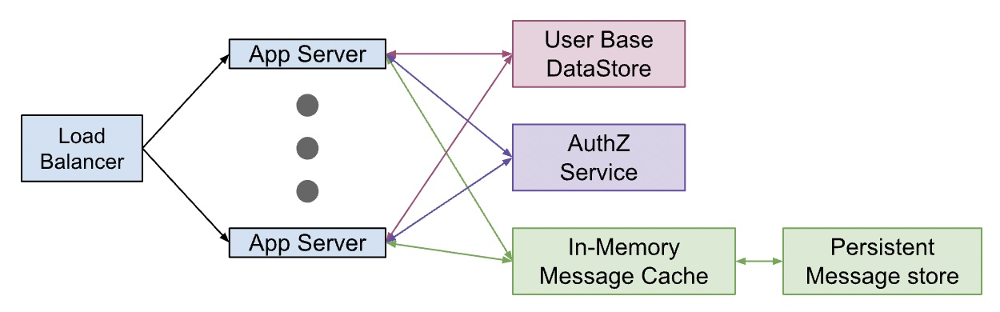

# Context

SampleCompany provided [this problem definition(redacted)]() as part of System Design Question. And the following prompt:

> Please share a strategy for how you would transition from the traditional multi-tenant architecture, where all data is siloed at each tenant (workspace), to a version of Slack’s architecture that enables multi-tenant inter-connectivity between workspaces on Slack.

# Assumptions

- **Database**: Since migration strategy is an explicit ask, the first question we need to answer is what kind of a database is being used? Based on the conversation with Alejandro, we know SampleCompany uses mongodb. The discussion below will be focussed on solving the problem for mongodb.
- **Operational Environment**: While the problem statement is asking to solve for the slack multi-tenant inter-connectivity, we will assume it is being applied for SampleCompany,
  especially in regards to operational environmental needs.
- **Authentication**: Since authentication is already being used, we'll piggy back on it. We will assume that
  a user ID is somehow available for us to use within authZ requests.

# Approach

Good system design should reduce problems into smaller parts, and apply a sequence of these smaller solutions
to accomplish the larger goal. To that end, we should split our multi-tenant inter-connectivity problem into
two parts:

1. DB migrations: This is critical for our needs, but also more generally.
2. Authorization: The "real" prize we are chasing.

## DB Schema Migrations

For any application, database migrations are expected to be a frequent operation. While
the prompt calls for solving a specific problem, database schema migrations should _always_ be solved for the general case. Technical debt on this front is a really bad idea.

Any experienced systems engineer will tell you, that DB migrations are associated with
unpleasant memories of pain. They typically involve some downtime, things that go wrong,
having to roll-back changes among other issues.

Additionally, peak usage for the SampleCompany use-case, is in the 9a-5p window, which is
also the peak developer productivity time-window. It's generally accepted wisdom, that
developers should make production changes in this window.

The factors discussed above, strongly lead us to a conclusion that we should explore
a `zero-downtime` migration strategy for database schema changes.

Surprisingly, it seems mongodb doesn't have a helper library to provide zero-downtime migrations.
Please see [`zero-downtime` migration strategy](./zero-downtime-migrations.md) for a detailed discussion
of the issues involved and how we might address them.

## Authorization

Authorization is a complex domain, with a very large surface area. Like security, it's usually
very unwise to DIY a solution here. We should select one of the [many options](https://www.libhunt.com/r/oso) available.

This repo originally demonstrated how to use [oso](https://github.com/osohq/oso) to implement the authorization layer, however other choices are equally viable. Please see [here](../DESIGN.md) for more details on an oso based design.

We will assume that one such library will be used to decouple the authZ needs of the application.
Such authZ libraries have the advantage of splitting the authZ problem into two sub-parts:

1. authZ policies - these are the enforceable requirements - they can be dynamic, but typically at product management cadence.
2. authZ data - these are the actual users, workspaces, and channel IDs - they are dynamic in the extreme, being created/deleted/modified by users at run time.

The prompt asks to design an RBAC authZ capability for a single service, scaling to about 10M users at the
high end. Authz rules at that scale would easily fit on a single machine's main memory. We should keep things simple and design the authZ capability as an independent service.

A selection criteria between the various choices should boil down to the following:

1. The ability of the authZ library to scale for our needs (given the scale, this is not anticipated to being an issue)
2. The flexibility of the authZ library - RBAC, ReBAC, ABAC. Even if we don't need all of them right now, the optionality will help as our product requirements morph.
3. The expressivity of the policy language. By choosing a library, we are delegating all the heavy lifting to the library. What this means in practice is that developers will spend all their time reducing product requirements to policy assertions. The SampleCompany product lives in a complex authZ environment, and one should anticipate all kinds of difficult use cases. The easier it is to reason about the policy, the more likely the developer is to get it right.

# Design

With that preamble, we are finally ready to design the requested system.

Since we have assumed that we are designing a system to fit SampleCompany's general parameters,
we are using mongoDB and designing to a scale of about 10M users/100M messages on an yearly basis. 


The current SampleCompany design is an App Server backed by a mongo DB instance. 
This proposal adds:

1. An independent AuthZ service
2. A load balancer and horizontally scale the App Server. The load-balancer is required to standup `v(n+1)` of the API while `v(n)` is still active.

### App Server

The App server is shown to be horizontally scalable. Depending on performance/UX specifications, it might be possible to enhance this into a SSR/SSG + API server. There are other options, that might help speed things up and reduce operational complexity and cost, but are more intrusive to the current architecture. These should be dealt with as a separate feature.

### AuthZ Service

The AuthZ service is split into an independent entity here, to allow it to be decoupled from
the main data store. The advantage of this as the load grows, and performance becomes a bottleneck,
we can create shard the user requests across the app-servers, and cache the authZ data on the
app-servers. To start however, we should keep it simple, maintain an independent service and
access it directly.

### Message Service

The Message service is responsible for storing the messages - both for quick temporal access
as well as longer term (auditable) persistence. 

It's not clear how messages are being stored currently - within the monolith or as a separate service. Initially, we'd continue to use the existing mechanism, but at some point of scale, it might become 
necessary to split the message storage into an independent service.

Some further design considerations are discussed in response to the prompt question (a) below.

## Resolvers

All of the design in the world doesn't yet get us to the actual usages of these patterns.
The primary goal of the design has been to de-couple the various requirements -
authZ, multi-tenant inter-connectivity, and scalability.

The proof of that pudding is in it's usage - which shows up in how we implement our
resolvers. Based on the system design prompt we are responding to, we will restrict
ourselves to solving for RBAC.

### The userId and resourceId are available within the request context.

```typescript
export async function resolver(
  parent: any,
  args: any,
  context: Context,
  info: any
) {
  const { db, resourceId, userId } = context;
  if (
    await authz.isAuthorized(userId, "resolver specific permission", resourceId)
  ) {
    // the resolver works it's business logic
    return someData;
  }
}
```

### The resourceId needs to be fetched from the DB before making a decision

Notice, that we have wrapped the call to `db.collection.get()` with a `migrate()`
This is meant to ensure that all data that is accessed is of the right-version.
The migration library is imaginary at this point, but specified at a high level
in the [zero-downtime migration](./zero-downtime-migrations.md) document.

```typescript
export async function resolver(
  parent: any,
  args: any,
  context: Context,
  info: any
) {
  const { db } = context;
  const { resourceId } = migrate.collection(db.collection.get(userId, args));
  if (
    await authz.isAuthorized(userId, "resolver specific permission", resourceId)
  ) {
    // the resolver works it's business logic
    return someData;
  }
}
```

## Responses to followup questions

### a. Scale (1/10M -> 10/100M)

There are two sub-problems here -

1. Managing the user-base and their workspaces/connections/channels (1 -> 10M)
2. Managing messages (10 -> 100M)

The two exhibit very different read/write characteristics and should be handled independently.

#### 1. The user base

- write load: relatively low frequency, low cadence.
- read load: Approx once per day (really once per login) for DAU. Which is likely to be a small fraction of the full user base.
- the data has a high consistency and availability need.
- this scale of data and access be easily managed on a single node, replicated datastore.
- Since the read load is much higher than the write load, it's also possible to scale
  the system to being much larger by using an in-memory cache.

#### 2. Messages

- the read load is a slight multiplier on the write load, since in general a channel will have
  multiple members. Since we are making blind assumptions, we'll apply this to the SampleCompany
  use case, and assume an avg of 5 members/channel.
- the data has a temporal accessibility need. Especially given that we are applying it to a school
  setting useful life of a message might be more like 6 months or less. If durability of messages
  is a requirement, it is likely best to duplicate the messages on write - to something like S3
  AND the mongo DB instance. The mongoDB collection should have a TTL index to clean up older
  messages.
- Depending on the access patterns, once we see problems with performance of the message access,
  it might be time to consider an inline caching system like Redis.
- As a design principle, we should avoid over-engineering this too early - in architecture or
  application complexity.

### b. DataModel

For the given data-model, we'd make the following additions:
- add a Connection collection and appropriately link them into channels and users. 
- define the ChannelRoles

```diff
+interface Connection {
+  // unique ID for this connection
+  id: string;
+
+  // the workspace ID that this connection is initiated from
+  fromWorkspaceId: string;
+
+  // the workspace ID that this connection is initiated to
+  toWorkspaceId: string;
+
+  // name of this connection, such as #connection-name
+  name: string;
+
+  // Date-time for when this connection was created.
+  createdAt: Date;
+}
+
+interface ConnectionRole {
+  // the workspace this role is tied to
+  workspaceId: string;
+
+  // the connection this role is tied to
+  connectionId: string;
+
+  // CONNECTION_ADMIN or CONNECTION_MEMBER of the connection
+  roleType: string;
+
+  // The creation date of this role
+  createdAt: Date;
+
+  // The most recent date this role is archived
+  archiveDate: Date;
+}
+
 interface Channel {
   // unique ID for this channel
   id: string;

-  // the workspace ID that this channel is contained in
+  // the workspace/connection ID that this channel is contained in
   workspaceId: string;
+  connectionId: string;

   // name of this channel, such as #channel-name
   name: string;

   // Date-time for when this channel was created.
   createdAt: Date;
 }

 interface User {
   // unique ID for this user
   id: string;

   // name of this user
   name: string;

   // email address of this user
   email: string;

   // the list of roles that this user holds in the workspace
   workspaceRoles: WorkspaceRole[];

   // the list of roles that this user holds in particular channels
   channelRoles: ChannelRole[];

+  // the list of roles that this user holds in particular connections
+  connectionRoles: ConnectionRole[];
+
   // Date-time for when this user was created.
   createdAt: Date;
 }
```

### c. API

From the API perspective, we will assume existing authN capability, allows authZ modifications
can be completely restricted to being server side.
We do need to extend the API to allow the user to perform these two operations from the UI.

```graphql
type Mutations {
  # Additional
  connectWorkspaces(
    fromWorkspaceId: String,
    toWorkSpaceId: String,
    peerAdminId: String
  ): Connection

  acceptInvite(
    connectionId: String,
    invitationCode: String
  )
}
```

### d. authZ modifications on the API

As stated in the discussion above, authZ modifications should not affect the API.
It's true that we need more APIs to enable different connectivity, however that is
for additional capability to invite other workspaces/admins and accept invitations.
Not by itself an authZ capability.

### e. Migration plan

At a high level, we will spell out the tasks, to help us scope the problem
and possible team size. For the purposes of this exercise, we will assume that 
the additional work in terms of the infrastructure is to be minimized. We are
piggy-backing on existing infra and only making minimal additions.

#### Task-list
These tasks are listed approximately in chronological order, with appropriate 
expertise called out. We will need more information on the size of the API 
and expertise of the team to decide how best to split up the work. 

- [ ] (lib) zero-downtime library development
- [ ] (lib) Unit tests for the zero-downtime library
- [ ] (api) API audit to decide the authentication rules
- [ ] (api) API changes so client development can start
- [ ] (authz) Development of the AuthZ policies
- [ ] (authz) Unit tests for the AuthZ policies
- [ ] (service) AuthZ service development
- [ ] (api) API changes to implement appropriate AuthZ calls
- [ ] (api) API+Authz integration tests
- [ ] (api) API+zero-downtime integration tests
- [ ] (ui) Additional screens to support the add-channel/accept-invite API calls
- [ ] (ui) split the channels presentation to be grouped by connections/workspace
- [ ] (ui) integration tests
