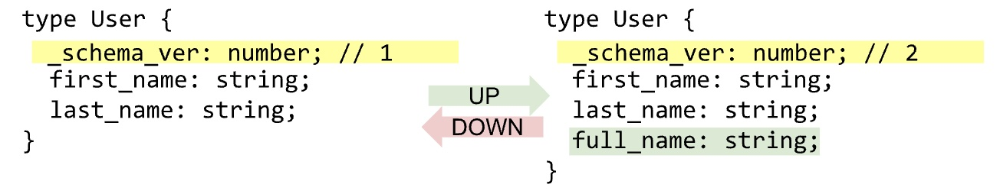
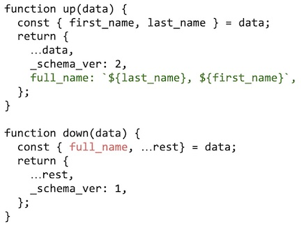
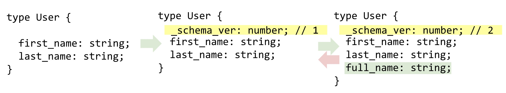

<!-- START doctoc generated TOC please keep comment here to allow auto update -->
<!-- DON'T EDIT THIS SECTION, INSTEAD RE-RUN doctoc TO UPDATE -->
**Table of Contents**  *generated with [DocToc](https://github.com/thlorenz/doctoc)*

- [Zero Downtime Migrations](#zero-downtime-migrations)
  - [1. The Happy Path](#1-the-happy-path)
  - [2. The Unhappy Path](#2-the-unhappy-path)
  - [3. The Late To The Game Path](#3-the-late-to-the-game-path)
  - [4. Stale Data](#4-stale-data)
- [Conclusion](#conclusion)

<!-- END doctoc generated TOC please keep comment here to allow auto update -->

# Zero Downtime Migrations 

Zero downtime migrations rely on embedding a _schema_ver field within the schema, and using that as a discriminant *on access*, to determine if a data object needs to be rolled forward or backwards.

The general mechanics are represented in the picture below:

Per collection, per version, the developer defines an `up()`/`down()` function.

NOTE: This shows the simple case of updating fields at the root level. 
The developer is responsible to invoke the `migrate.${collection}(data)` call as needed.

> ## Implementation note
> Currently, npm does not seem to have a library for a mongo migration with zero down time. 
> By the time we are ready to implement this feature, we will author such a library. 
>
> Such a library would provide:
> - Per collection:
>   - A template (filled in by the developer) to define a version specific:
>      - up/down methods
>      - schema_version (as an number/semver)
> - A mechanism to register each version along with its up/down methods, 
> - An ability to provide a custom `comparator` function (on setup)
> - Convenience method `migrate.${collection}(data)` which invokes all necessary up/down sequences

Zero Downtime Migrations (as applied to mongodb), imply that the application: 
- stores an active schema version number, _per collection_
- provides and `up()` & `down()` method to transform data from/to the previous version
- registers the appropriate versions for each collection
- invokes the library's `migrate.${collection}(data)` method on data retrieval, _before_ accessing the data object.

Done right, this is a simple and general enough scheme. However, like all things in software, it comes with the caveat to "watch out for the corner cases!".

In the discussion below, we walk through the following cases:
1. **The happy path**: We make modifications, and move forward successfully.
2. **The unhappy path**: We made a modification, found a problem and have to rollback to a previous version.
3. **The late to the game path**: In our hurry to get started, we didn't think of migrations, but we need it now. What do we do?
4. **Stale Data**: Since we only update data _on access_, what about data that never gets accessed?

## 1. The Happy Path
This is the simplest case. Say version 1 is the currently deployed API version.
The migration playbook looks like this:
1. Create migration functions for version 2 (the `up()`/`down()` functions)
2. After the proper registration of these, ensure appropriate calls to `migrate.${collection}(data)`
3. Deploy version 2 of the API (it isn't yet live)
4. Switch the load balancer from version 1 => 2
5. Bring down the version 1 API

As the client makes data access requests via the version 2 API, the calls to `migrate.${collection}(data)`
transform the data to version 2.

This transformation is however "in memory". We now have to decide when the record be updated in the database.
For read heavy loads, this transformation will happen many times and waste CPU cycles and impact over all latency. 
We should update the record on first transformation. Unless the system has a very light load, we should update
the record on write in all other cases. 

We are discussing the happy path case here. This implies we are flawless programmers, invoking 
`migrate.${collection}(data)` only ever invokes the `up()` function and we can live happily every after.

## 2. The Unhappy Path
This is the most complex of the three cases we consider. Before we dig, let's set the stage:
- A schema migration was applied as in the case above, but something is not working
- It's critical to get the site back up and the decision has come down to rollback to the previous version
- However, in the interim, an unknown number of objects have been migrated upwards to the "broken" version

A rollback is now extremely complicated. If we continue our example from the happy path discussion, 
we cannot just reverse the 3-5 steps in that workflow. Version 1 has no idea how to downgrade any version 2 objects. 
In fact, the only way to go back to v1 of the data, is to invoke the `v2.down()`.

For this reason, it's probably best to think of this "rollback" as actually a "roll-forward".
The v3 branch of the API is forked from v1, but in it's `up()` method, invokes `v2.down()`.

And now we can deploy APIv3, switch to it, and all objects will "revert" back to their v1 state over time. 

## 3. The Late To The Game Path
This occurs when we punted forward the need to design a migration strategy, and the current object version
is missing a version number.

We'll borrow a trick from the "roll-forward" use case above, and implement the solution in teo steps:
1. add the `_schema_ver = 1` field to the object. This also introduces the version handling capability to the code base.
2. perform the migration as normal but the first real "migration" results in `_schema_ver = 2` in the final analysis.

The strategy is depicted in the figure below:

## 4. Stale Data
Our zero downtime schema updates data on access. This means that unless we access each object in a collection,
there will be "stale data" in the datastore. If and when this becomes an issue, we'll need a background task that performs necessary updates. Depending on the references and atomicity requirements of schema, this might or might not be doable with zero-downtime.

# Conclusion
We have explored the design issues around zero-downtime pretty extensively. Importantly, we have designed
a solution that works for the general migration use-case.

With that we can go back to our [regular programming](./index.md).